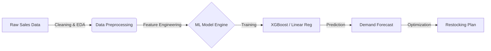

# 📦 DeliveryWise: Intelligent Supply Chain Optimization


> **"Stopping Retail Waste before it happens."**

## 📖 Project Overview
**DeliveryWise** is an end-to-end Machine Learning solution designed to solve the **Inventory Management Dilemma** faced by local retailers and warehouses.

Retailers often struggle with:
1.  **Overstocking:** Leading to perishable waste and lost capital.
2.  **Understocking:** Leading to missed sales opportunities and unhappy customers.

This project uses historical sales data to predict future demand, allowing businesses to optimize their supply chain logistics dynamically.

---

## 🏗️ Architecture & Workflow

Current development focuses on the **MVP (Minimum Viable Product)** architecture:



## 🛠️ Tech Stack

* **Core:** Python 3.10
* **Data Processing:** Pandas, NumPy
* **Machine Learning:** Scikit-Learn, XGBoost (Planned)
* **Visualization:** Matplotlib, Seaborn
* **Dashboard (Upcoming):** Streamlit
* **Database (Upcoming):** PostgreSQL

---

## 🗺️ Development Roadmap (Zero to Hero)

We are currently in **Phase 1**.

* [x] **Phase 0:** Project Setup & Repository Initialization
* [ ] **Phase 1: Data Analysis (Current Focus)**
* [ ] Cleaning raw retail datasets.
* [ ] Exploratory Data Analysis (EDA) to find seasonality trends.


* [ ] **Phase 2: Model Building**
* [ ] Baseline Model (Linear Regression).
* [ ] Advanced Model (Random Forest/XGBoost).


* [ ] **Phase 3: Deployment**
* [ ] Building the Streamlit Dashboard.
* [ ] Dockerizing the application.


---

## 📉 The Business Impact (Why this matters?)

By accurately predicting demand, **DeliveryWise** aims to:

* Reduce inventory holding costs by **~15%**.
* Minimize waste of perishable goods.
* Automate the manual "guesswork" in restocking.

---

## 🚀 How to Run (Local Development)

Since the project is under active development, follow these steps to explore the current codebase:

1. **Clone the repository:**
```bash
git clone https://github.com/Ashita-no-Kaushar/DeliveryWise.git

```


2. **Navigate to the directory:**
```bash
cd DeliveryWise

```


3. **Install dependencies:**
```bash
pip install -r requirements.txt

```


4. **Run the analysis script (Coming Soon):**
```bash
python src/analysis.py

```


---

## 🤝 Contribution & Contact

This project is part of my journey to master **Data Science & Engineering Logic**.
If you have suggestions for optimizing the ML pipeline, feel free to open an issue!

* **Author:** Kaushar
* **Role:** Aspiring Data Analyst | 3rd Year CSE
* **LinkedIn:** [Kaushar Halani](https://www.linkedin.com/in/kaushar-halani)

---
*Last Updated: Jan 2026*
---

